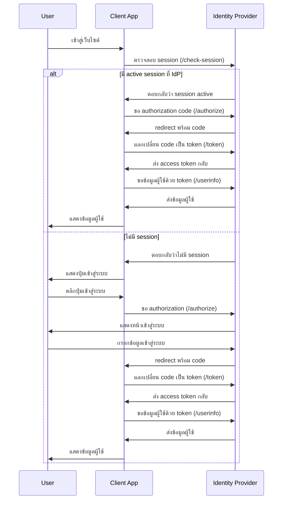
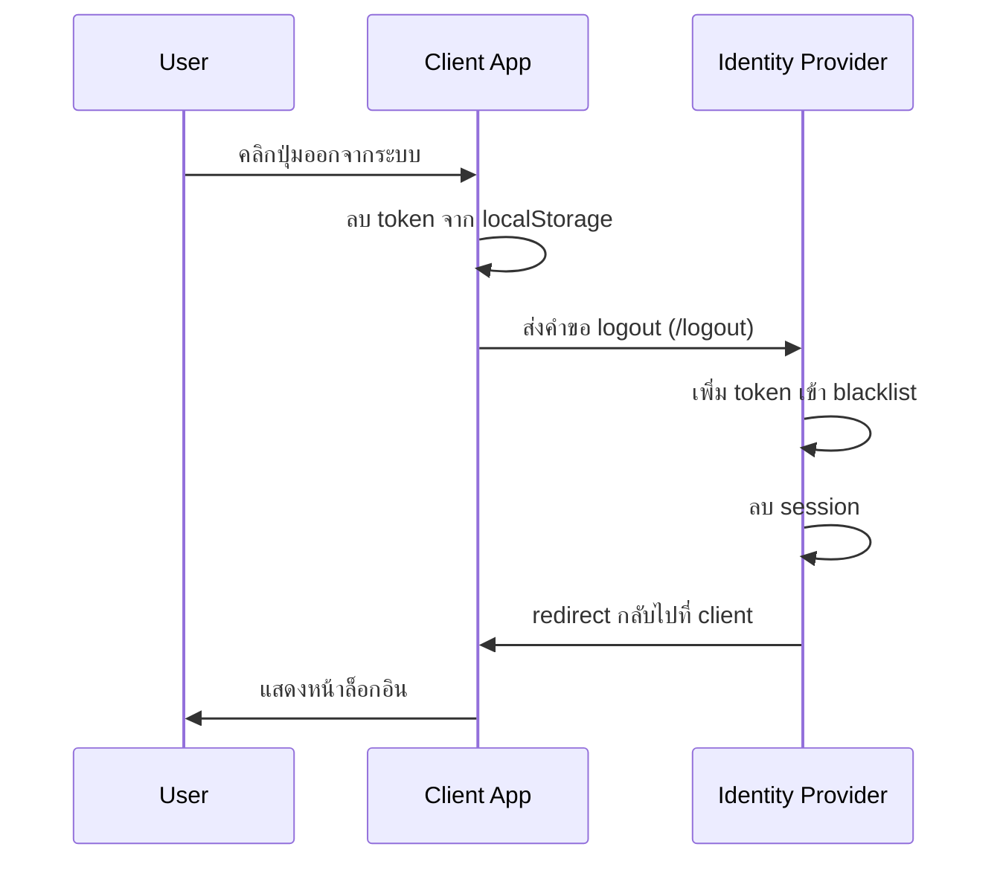

# โครงการ Single Sign-On (SSO) แบบพื้นฐาน

[](https://mermaid.live/edit#pako:eNplksFuwjAMhl_Fyml7AO4bMGlS0bTTkHbYBYWTlI1BnCpJQYzyKHuWOU4LZSByk-3_-_cnTtyzVlrCU_a0lJScGcii2aqjptznakGBcmad0vKQc94aT8uzyrBT4i8DagLOcL-1-cvyVfQGlbYvPjozGWnTnl-a5rnrldO0G2kBLRMG_ba1BOs7GssjWz-s6z85LwwALr2GmzpLM4TOUwDTUBmn2PPUbHBn6dvs2ox8afKnYnzIfYwpnDzuIXDVR86rsdAeqTETR9XZESsqPunoFgYdSMsDm1ug2YAMLaSlDPhOvDtt0O7bvCPPWmbw3WekOSg2TRhDsqdtf3j34-_rkJ0UKz7EtXlv6CKLZ5Z4KxkM8i8W8GCVMsCdQE-ynOPiwkXGEl2NoeJJT9bQL3l7pkaVvkhWRvB-Bh85wYRlOnkab08D6-cpS9pOj9AIZd9T4CzIwuT_3oHXvNUylKHqhAmI_7Gc1Iur9Q8FzOiF)

## บทนำ

Single Sign-On (SSO) เป็นกลไกการพิสูจน์ตัวตนที่ช่วยให้ผู้ใช้สามารถเข้าสู่ระบบครั้งเดียว แล้วเข้าถึงหลายระบบได้โดยไม่ต้องลงชื่อเข้าใช้ซ้ำ โครงการนี้แสดงการทำงานของ SSO แบบพื้นฐานโดยใช้ OAuth 2.0 Authorization Code Flow

## โครงสร้างโปรเจค

โปรเจคนี้แบ่งเป็น 2 ส่วนหลัก:

```
SSO/
├── idp-server/           # Identity Provider Server (Node.js/Express)
│   ├── src/
│   │   ├── data/         # จำลองฐานข้อมูลผู้ใช้
│   │   ├── middleware/   # Middleware สำหรับจัดการ Session
│   │   ├── routers/      # เส้นทาง API ต่างๆ
│   │   ├── utils/        # Utility functions
│   │   └── index.js      # จุดเริ่มต้นของเซิร์ฟเวอร์
│   └── public/           # ไฟล์ static เช่น หน้า login
│
└── client-react/         # ตัวอย่าง Client Application (React)
    ├── src/
    │   ├── components/   # UI Components
    │   ├── config/       # การตั้งค่า SSO
    │   ├── contexts/     # React Context สำหรับจัดการ Authentication
    │   ├── services/     # บริการเชื่อมต่อกับ IdP
    │   └── App.jsx       # Component หลัก
    └── .env              # Environment variables
```

## การทำงานของ SSO Flow

### 1. Authorization Code Flow



### 2. Logout Flow



## รายละเอียดของแต่ละส่วน

### Identity Provider (IdP) Server

IdP เป็นเซิร์ฟเวอร์ที่จัดการการพิสูจน์ตัวตนซึ่งมีความสามารถดังนี้:

#### 1. Endpoints หลัก

| Endpoint         | วิธี     | คำอธิบาย                                |
| ---------------- | -------- | --------------------------------------- |
| `/authorize`     | GET      | เริ่ม OAuth flow และให้ code แก่ client |
| `/token`         | POST     | แลกเปลี่ยน code เป็น access token       |
| `/userinfo`      | GET      | ส่งข้อมูลผู้ใช้ตาม token ที่ให้มา       |
| `/check-session` | GET      | ตรวจสอบว่าผู้ใช้มี session อยู่หรือไม่  |
| `/login`         | GET/POST | หน้าและการประมวลผลล็อกอิน               |
| `/logout`        | GET      | ทำการออกจากระบบและเพิกถอน token         |

#### 2. ระบบจัดการ Session

เซิร์ฟเวอร์ใช้ customSession middleware ที่พัฒนาขึ้นเองเพื่อจัดการ session โดย:

- เก็บข้อมูล session ไว้ในหน่วยความจำ (ในระบบจริงควรใช้ Redis หรือ database)
- จัดการ cookie สำหรับติดตาม session
- ตั้งค่าการหมดอายุและทำความสะอาด session อัตโนมัติ

#### 3. Token Blacklist

ระบบมีกลไก blacklist สำหรับ token ที่ถูกเพิกถอนเมื่อผู้ใช้ logout:

- เก็บ token ที่ถูก revoke ในหน่วยความจำ
- ตั้งเวลาลบ token จาก blacklist เมื่อหมดอายุ
- ป้องกันการใช้ token ที่ถูกเพิกถอนแล้ว

### React Client

Client เป็นแอปพลิเคชัน React ที่ใช้ระบบ SSO โดยแบ่งเป็นส่วนต่างๆ ดังนี้:

#### 1. โครงสร้าง Component

```
App
└── AuthProvider (context)
    └── MainContent
        ├── Header
        ├── UserProfile (เมื่อเข้าสู่ระบบแล้ว)
        │   หรือ
        ├── LoginScreen (เมื่อยังไม่ได้เข้าสู่ระบบ)
        └── Footer
```

#### 2. การจัดการ Authentication

- `AuthContext`: จัดการสถานะการเข้าสู่ระบบและข้อมูลผู้ใช้
- `authService`: ให้บริการเชื่อมต่อกับ IdP Server

#### 3. การจัดเก็บ Token

- ใช้ `localStorage` เก็บ access token
- เมื่อ refresh หน้า จะตรวจสอบ token และดึงข้อมูลผู้ใช้ใหม่

## วิธีการติดตั้งและใช้งาน

### Identity Provider Server

```bash
cd idp-server
npm install
# สร้างไฟล์ .env ด้วยค่า JWT_SECRET
echo "JWT_SECRET=your-secret-key" > .env
npm start
```

### React Client

```bash
cd client-react
npm install
# สร้างไฟล์ .env ด้วยค่าตามต้องการ
echo "VITE_IDP_URL=http://localhost:4000" > .env
echo "VITE_CLIENT_ID=client-one" >> .env
npm run dev
```

## ข้อมูลทดสอบ

ระบบมีบัญชีผู้ใช้ทดสอบดังนี้:

| Email          | Password | บทบาท |
| -------------- | -------- | ----- |
| test@mail.com  | 1234     | user  |
| admin@mail.com | 1234     | admin |
| user@mail.com  | 1234     | user  |

## การพัฒนาต่อยอด

ระบบนี้เป็นตัวอย่างพื้นฐานเพื่อการเรียนรู้ สำหรับการใช้งานจริงควรเพิ่มเติม:

1. **ความปลอดภัย**:

   - ใช้ HTTPS
   - เพิ่ม PKCE สำหรับ OAuth flow
   - เพิ่ม client secret และการยืนยันตัวตน client

2. **การจัดเก็บข้อมูล**:

   - ใช้ฐานข้อมูลสำหรับเก็บข้อมูลผู้ใช้
   - ใช้ Redis หรือ database สำหรับ session และ token blacklist

3. **คุณสมบัติเพิ่มเติม**:
   - Refresh token
   - ให้สิทธิ์แบบละเอียด (fine-grained permissions)
   - รองรับหลาย IdP เช่น Google, Facebook

## สรุป

โปรเจคนี้แสดงการทำงานพื้นฐานของ Single Sign-On โดยใช้ OAuth 2.0 Authorization Code Flow เพื่อให้เข้าใจแนวคิดหลักของ SSO:

1. การเข้าสู่ระบบครั้งเดียวและใช้งานได้หลายระบบ
2. การใช้ session และ token ในการยืนยันตัวตน
3. การแลกเปลี่ยนข้อมูลระหว่าง Identity Provider และ Client Application

การศึกษาโค้ดของโปรเจคนี้จะช่วยให้เข้าใจถึงกลไกการทำงานของ SSO และสามารถนำไปประยุกต์ใช้กับโปรเจคจริงต่อไป

---

## อ้างอิงเพิ่มเติม

- [OAuth 2.0 Authorization Framework](https://oauth.net/2/)
- [OpenID Connect](https://openid.net/connect/)
- [JWT (JSON Web Tokens)](https://jwt.io/)

```

```
